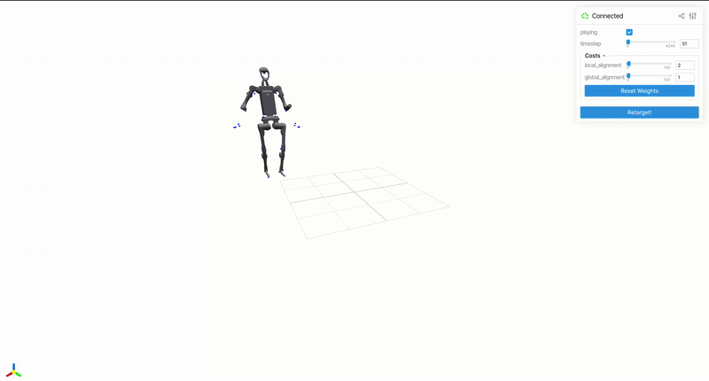

# Retargeter BVH-to-H1 using Pyroki

This repository provides a "homemade" solution to retarget BVH motion data to the H1 robot. While there are many ways it could be improved (such as leveraging the SMPL model for more accurate mapping), it is intended as a lightweight fallback solution — particularly useful when working on imitation learning and in need of a quick, functional retargeting pipeline.



## Usage

Clone the repository and 
```
pip install -r requirements.txt
```
Install also Blender because you will need it for the `scripts/extract_joint_positions_blender.py`

### Blender script

Firstly, open Blender and your BVH motion data in Blender. Then, go to Scripting and open `scripts/extract_joint_positions_blender.py` as a blender python script. Execute it, it should create a file named `joint_positions.npy` in your `Documents` repository : this is the position of each joint in the world frame.

### Mapping BVH to SMPL

Put the `joint_positions.npy` file inside the `data_folder` and type :
```
python scripts/mapping_bvh_to_smpl.py
```

This will create `data_folder/smpl_keypoints.npy`. Now you are ready to start the main script :
```
python retargeting.py
```

In the `retargeting.py` file, there is a `SAVING_RESULTS` bool that you can turn on if you want to save the results in a .csv file. It is in the format of [LAFAN1 Retargeting Dataset](https://huggingface.co/datasets/lvhaidong/LAFAN1_Retargeting_Dataset).
